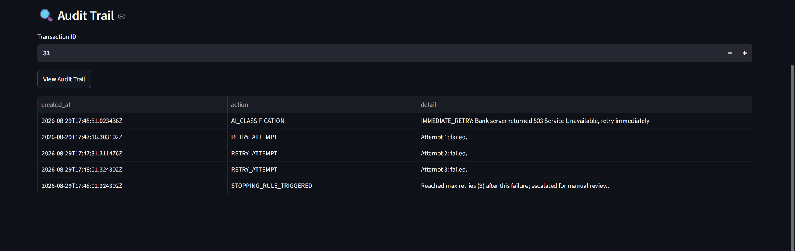

## Measured Results

Across 3 independent runs of a 50-transaction synthetic failed-payment batch:

| Run | Revenue at Risk | Revenue Recovered | Recovery Rate |
|---|---|---|---|
| 1 | ₹487,200 | ₹301,500 | 61.88% |
| 2 | ₹560,300 | ₹247,800 | 44.23% |
| 3 | ₹605,600 | ₹355,900 | 58.77% |
| **Average** | | | **~55%** |

All transactions in every run reached a terminal state (`RECOVERED`, `NEEDS_MANUAL_REVIEW`,
or `PERMANENT_FAILURE`) — zero unresolved retries by the time each batch settled.

Run-to-run variance is expected: `simulate_gateway_retry()` models each retry attempt as
succeeding with 55% probability (standing in for an actual gateway retry, since this runs
against synthetic data rather than live payment rails), and the observed ~55% average
recovery rate closely tracks that baked-in assumption — a useful sanity check that the
batch size and methodology are behaving as designed rather than producing noisy results.

Delivery note: one run recorded 48/50 successful webhook deliveries under a tight
0.2s-stagger burst; 2 requests failed with either a client-side timeout or a 500 from
the `/webhook/payment-failure` endpoint's Redis-queuing step. The 500 is deliberate —
the handler returns it specifically so a real payment gateway's webhook retry logic would
re-deliver the event — and is consistent with standard webhook delivery semantics under load.

### Example: Audit Trail for an Escalated Transaction



Every agent decision — classification, each retry attempt, and any stopping-rule
trigger — is logged with a timestamp and explanation, giving a full explainable
trace for every transaction.

### Reproducing these results

```bash
python -m scripts.wipe_db
# start Celery worker + FastAPI app in separate terminals, then:
python -m scripts.simulate_events
# wait for the dashboard to show "Still Retrying: ₹0", then check /analytics
```

## Testing

Two automated tests cover the core correctness guarantees this track is judged on:

- **`tests/test_idempotency.py`** — proves that sending the same webhook payload
  (same `idempotency_key`) twice results in exactly one `Transaction` row, not two.
- **`tests/test_stopping_rule.py`** — proves the retry loop actually halts at
  `MAX_RETRIES` and escalates to `NEEDS_MANUAL_REVIEW`, and that transactions
  below the limit correctly reschedule instead.

Run against a dedicated test database (`revenue_recovery_test`), isolated from
demo data:

```bash
pytest -v
```

All 3 tests currently pass.